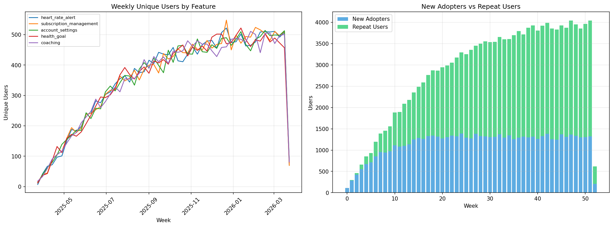
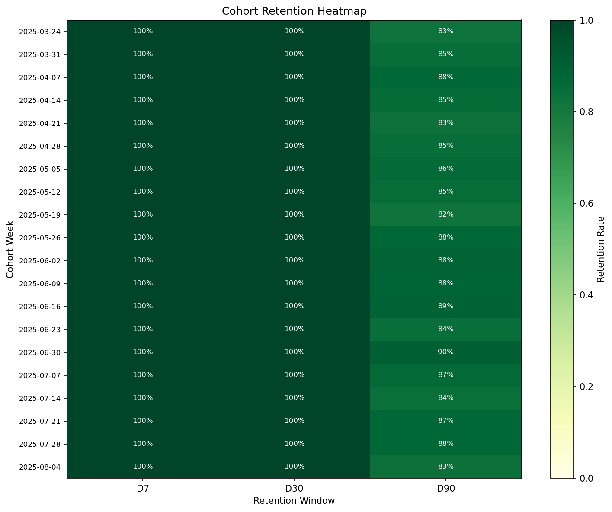
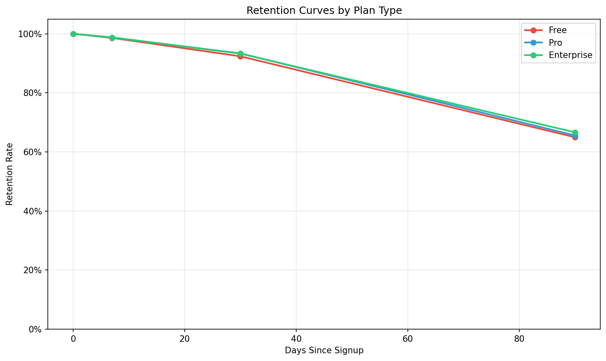

# Feature Adoption & Retention

**[Live Interactive Dashboard](https://nicholasjh-work.github.io/feature-adoption-retention/)**

dbt models and analytics for measuring how members adopt product features and how long they stay engaged. Builds on the synthetic data from [Infra-data-pipelines](https://github.com/nicholasjh-work/Infra-data-pipelines).

## Quick Start

```bash
git clone https://github.com/nicholasjh-work/feature-adoption-retention.git
cd feature-adoption-retention
pip install -r requirements.txt

# Requires infra-data-pipelines demo to have run first (PostgreSQL loaded)
python demo.py
```

## Demo Output

### Feature Adoption (Weekly Unique Users)



Top features by total unique users:
```
heart_rate_alert                18,928
subscription_management         18,869
account_settings                18,752
health_goal                     18,742
coaching                        18,724
```

### Cohort Retention Heatmap



Point-in-time retention using activity windows (not cumulative):
```
Overall retention:
  D7:  98.7%
  D30: 92.8%
  D90: 65.4%
```

### Retention by Plan Type



## dbt Models

### fct_feature_adoption

| Column | Description |
|--------|-------------|
| `week_start` | Start of ISO week |
| `feature` | Feature name (sleep_tracking, coaching, etc.) |
| `unique_users` | Distinct members who used the feature that week |
| `new_adopters` | Members whose first-ever interaction occurred that week |
| `repeat_users` | Members who returned from a prior week |

### fct_retention_cohorts

Point-in-time retention at 7, 30, and 90 days after signup.

| Column | Description |
|--------|-------------|
| `plan_type` | free, pro, enterprise |
| `acquisition_channel` | organic, social, paid, referral |
| `cohort_week` | Week of member signup |
| `cohort_size` | Members in the cohort |
| `retention_d7` / `retention_d30` / `retention_d90` | Point-in-time retention rates |

## Running with Snowflake (Production)

```bash
cp profiles.yml.example ~/.dbt/profiles.yml
cp .env.example .env
dbt build
```

## Related Repos

- [Infra-data-pipelines](https://github.com/nicholasjh-work/Infra-data-pipelines) - Data generation and ingestion
- [Experimentation-segmentation](https://github.com/nicholasjh-work/Experimentation-segmentation) - A/B testing and user segmentation

## Tech Stack

dbt, Snowflake, PostgreSQL, Python, pandas, matplotlib, SQLAlchemy
